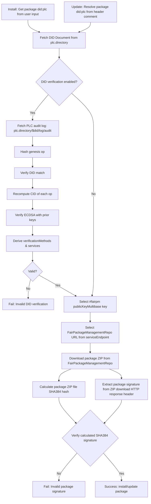
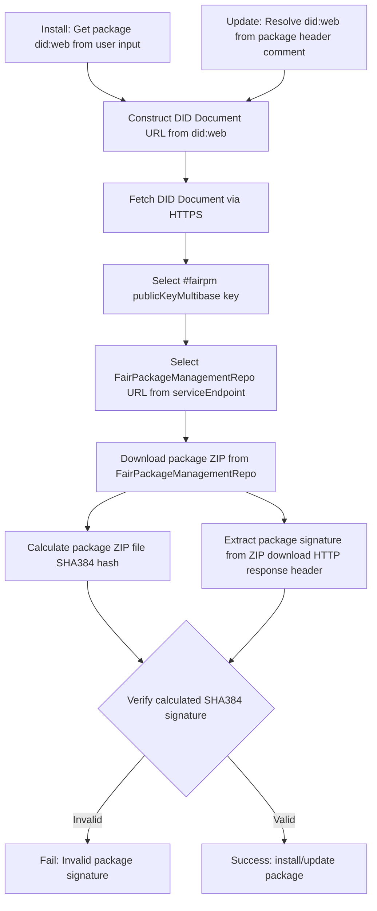

# DID Workflows

# did:plc

```mermaid
flowchart TD
    A1["Install: Get package did:plc from user input"]
    A2["Update: Resolve package did:plc from header comment"]
    A1 --> B["Fetch DID Document from plc.directory"]
    A2 --> B
    B --> C{"DID verification enabled?"}
    C -- Yes --> D["Fetch PLC audit log: plc.directory/$did/log/audit"]
    D --> E["Hash genesis op"]
    E --> F["Verify DID match"]
    F --> G["Recompute CID of each op"]
    G --> H["Verify ECDSA with prior keys"]
    H --> I["Derive verificationMethods & services"]
    I --> J{Valid?}
    J -- No --> X1[Fail: Invalid DID verification]
    J -- Yes --> K["Select #fairpm publicKeyMultibase key"]
    C -- No --> K["Select #fairpm publicKeyMultibase key"]
    K --> L["Select FairPackageManagementRepo URL from serviceEndpoint"]
    L --> M["Download package ZIP from FairPackageManagementRepo"]
    M --> N["Calculate package ZIP file SHA384 hash"]
    M --> O["Extract package signature from ZIP download HTTP response header"]
    N --> P{"Verify calculated SHA384 signature"}
    O --> P
    P -- No --> X2["Fail: Invalid package signature"]
    P -- Yes --> Q["Success: install/update package"]
```

#  

```mermaid
flowchart TD
A1["Install: Get package did:web from user input"]
A2["Update: Resolve did:web from package header comment"]
A1 --> B["Construct DID Document URL from did:web"]
A2 --> B
B --> C["Fetch DID Document via HTTPS"]
C --> D["Select #fairpm publicKeyMultibase key"]
D --> E["Select FairPackageManagementRepo URL from serviceEndpoint"]
E --> F["Download package ZIP from FairPackageManagementRepo"]
F --> G["Calculate package ZIP file SHA384 hash"]
F --> H["Extract package signature from ZIP download HTTP response header"]
G --> I{"Verify calculated SHA384 signature"}
H --> I
I -- Invalid --> X1["Fail: Invalid package signature"]
I -- Valid --> J["Success: install/update package"]
```
