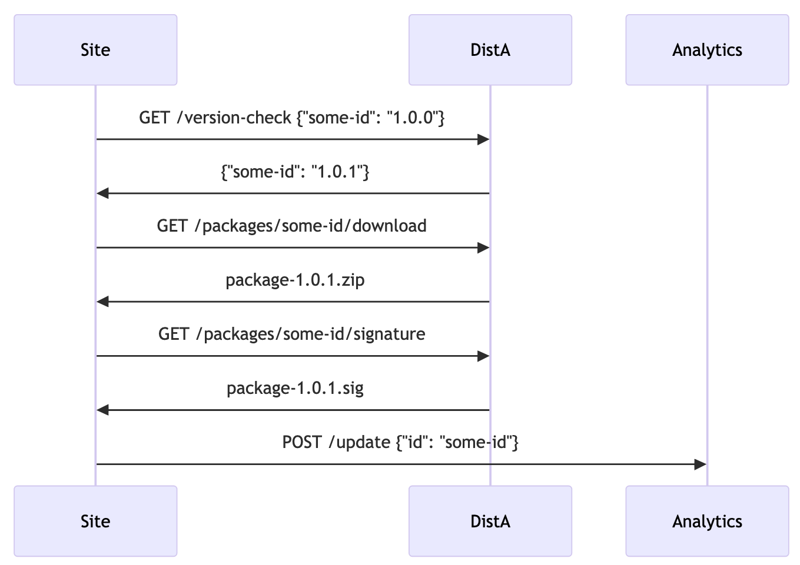

# FAIR System Design

This document is designed as a detailed technical overview of how the FAIR decentralized concept works, including background information on inspiration.

## Prior Art

### Linux Package Distribution

Linux distributions provide package managers which typically allow for multiple "sources" for packages. This allows sysadmins to use alternatives to the "official" source for packages; the mirror system also allows one logical name to be tied to multiple underlying servers.

This also incorporates package signing, however this is implemented as a layer on top of the distribution system. Trust is assigned at the repository level, not the package level, allowing a malicious trusted repository to hijack a package - "the ACF problem".

The mirror system also leads to complexity in synchronization, and does not provide any authoritative source of data for usage statistics.

### Composer

Composer is a package manager for the PHP ecosystem. It consists of "repositories" which host any number of "packages".

It connects to any number of repositories, but is primarily built on top of the Packagist service, which is run by a for-profit company (Private Packagist). Mirrors (partial or full) can be specified as repositories - this can be used for mirroring packages 1:1, but can also be used to override packages.

Composer's primary usage is for developers, and the complexity of the tool and system can be difficult to use for end-users. Some projects (e.g. Drupal) build on top of this, but no one offers a system as user-friendly as WP's using Composer - and it may not be possible.

The internals of Composer are difficult to reuse in other contexts, and it is not guaranteed to have a stable API.

### AT Proto

- <https://atproto.com/>

- <https://atproto.com/articles/atproto-for-distsys-engineers>

AT Proto is the protocol underlying Bluesky, which was developed in response to an existing centralized service as a way to redesign to avoid the problems centralization had created.

AT Proto's design is to mirror the way the web works: a lot of independent hosts of data, and "aggregators" that bring it all together. On the web, those are tools like search engines and indexes.

The protocol also decouples data storage from distribution. Users can run a Personal Data Server (PDS) which stores their data, but that data can be duplicated and indexed as needed; "aggregators" are responsible for bringing this data back together - they turn the constellation of the small web back into a scalable service. (The main aggregator in the Bluesky network is the Bluesky relay server.)

To replicate a social network like Twitter, aggregators provide things like the main feed algorithm, search service, trends, and moderation feeds. Users can explicitly choose which main feed algorithm they want to use, and the setup of which other services they want to use.

This avoids some of the big synchronisation problems that occur with similar protocols (like ActivityPub) by reducing duplication and overhead, avoiding massive mirrors of all content, while still ensuring no single player can hijack the ecosystem.

We look to AT Proto as a great example of a specific response to centralisation - there's plenty that will be applicable, but also aspects that aren't, since their problems aren't the same as ours. In the social web, all players are equal - but we're designing a distribution system of providers and users, not a social network.

### WordPress already

WordPress already has a type of decentralized system hacked into it, with premium plugins and tools like Git Updater having to be grafted on to core's update system - and with no potential to integrate into the core install system (there is no way to find the plugin from within WordPress dashboard at this time).

Each implementation integrates independently, with two large implementations commonly used: EDD's Software Licensing updater, and Git Updater.

This means that the flow today for many sites looks like:

 

Notably though, none of these providers speak a common protocol, and all have to integrate into WordPress independently. This makes it more difficult to develop new plugins, and stifles innovation. Integrating these natively will make it much easier for new vendors, and can also solve the new install problem too.

## Our Protocol

Taking lessons from the prior art in the ecosystem, we can model out a similar system.

(We'll use "package" to mean a plugin, theme, language pack - anything you can download and add into your WP install. The term "package" can even include WordPress core itself.)

We'll create three core concepts:

- Repository Nodes

- Aggregators

- Extras (e.g. Analytics)

The Repository Nodes are servers that provide package zips and some information about them (name, description, images, FAQ, etc).

The Aggregators are servers that provide any service that collects information about packages into one place - that includes a directory to discover new packages, a way to handle moderation, and other "meta" services. Aggregators do not contain zips or source code for any of the core or related software.

Additionally, we'll have some extras. Specifically, a neutral central analytics service that can provide information to aggregators, but is not essential.

To bootstrap the network, we'll create reference implementations of the Repository Node, some key Aggregators, and our analytics service - all as open source. We'll also run a central version of each to provide services to smaller players, while allowing bigger players to federate into the network when it makes sense. This will balance flexibility and independence with practicality and accessibility.

### Repository Node

A Repository Node is a simple server that acts as the original source for packages. It can offer a single package or an entire ecosystem's worth, but it is the canonical source for the packages it offers.

Repository Nodes can be fully open to use by anyone, fully private for internal usage in organisations, or a mix for companies with free and paid packages.

Sites can interact directly with Repository Nodes - for example, to check for new updates or to provide licensing data.

Repository Nodes are responsible for the publication and maintenance of the packages they offer, including updates and package signing.

Example endpoints for repository nodes might look like:

- `/packages` - List all packages the repository node offers.
- `/packages/{id}` - Get metadata about a specific package, including:
	- `name`, `id`, `description`
- `/packages/{id}/versions` - Get available versions of a package.
- `/packages/{id}/versions/{version}/download` - Download a specific package version.
- `/packages/{id}/versions/{version}/signature` - Get the package signature for a specific version.
- `/keys` - Get the public keys used to sign releases published by this node.
- `/version-check` - Check a bulk list of versions against the latest published by this node.

Custom authorization for repository nodes can be implemented for licensing, using a similar model to Composer's auth model.

(Detailed design on endpoints tbd, but can be modelled after Composer's design.)

### Aggregators

Aggregators pool information from multiple Repository Nodes to create an index, and offer various services based on this. They store some metadata about packages, but point sites to the actual Repository Node for the canonical information and downloads.

Since package metadata can be used for a wide variety of purposes, many different services are possible, but we think the following are the essential ones we'll need to start with:

- **Discovery** - An aggregator to find all available packages, and let users browse and search them.

- **Moderation** - An aggregator to flag insecure/bad packages (and package releases) as well as vouched packages - to provide a good/bad status to help users make an informed decision.

A single server could offer multiple types of aggregators - they don't need to be arbitrarily split.

We think there's a wide scope for businesses to build off the aggregation system. For example, products like Securi or Patchstack could offer their own security-focussed aggregators, while companies like WP Beginner could offer "beginner approved" status for reviewed packages.

Also, the network would be open to new aggregator types to allow for innovation - for example, a new recommender type could provide data-driven recommendations on great packages to solve user problems.

#### Discovery Aggregator

Example endpoints for a discovery node might be:

- `/packages` - List all packages this node knows about.
	- `/packages?tag=seo` - Get all packages tagged with "SEO".
- `/packages/{id}` - Get metadata about a specific package, including:
	- `name`, `id`, `description`
	- `repository_node`
- `/search` - Find packages by name, type, tag, etc.

#### Moderation Aggregator

Example endpoints for a moderation node might be:

- `/check/{id}` - Check a singular package's status data, including:
	- `score` - -1 for bad, 1 for good, 0 for neutral or unknown.
- `/check-all` - Check multiple packages.

### Analytics

This decentralised system leaves a problem of how we track and monitor data. Fundamentally, centralised analytics are at odds with a decentralised system.

To address this, we'll create a single, central component to collect analytics and provide the data. This will be intentionally centralised, and as a result, is designed to be outside of the "critical path" of the typical usage.

The analytics system will collect download and usage numbers directly from WP installs.

This component will be run for the common good, and will provide data neutrally to the entire ecosystem. Discovery aggregators can use the analytics data to recommend more popular packages, while brand new aggregators can learn about the whole ecosystem of repository nodes via the analytics service.

Aggregators and repository nodes can still collect their own data, but the use of a neutral service makes the data more reliable - it protects the ecosystem against repository nodes faking download counts, for example.

The analytics concept breaks from AT Proto, which gets "like" and "repost" counts by searching for like/repost events. In a social media context like AT Proto, all actors are public, whereas in our context sites are not public. Using a single, central, neutral service for the common good provides a simple way to fix this, while designing the protocol to not require it if it turns bad. This is not dissimilar to parts of other trust structures, such as [Sigstore's Public Good Instance](https://openssf.org/blog/2023/10/03/running-sigstore-as-a-managed-service-a-tour-of-sigstores-public-good-instance/).

## Data

Each package has some metadata associated with it, as well as package versions and assets (zips).

### IDs

To deduplicate packages across the entire system, we need a unique ID. We could pick an ID based on the repository node, similar to GitHub repositories (organisation/packagename) as this is the easiest - but it doesn't provide flexibility.

We have a few options.

#### (Reverse) DNS

Similar to other package management systems, we could use (reverse) DNS, e.g. org.example.my-plugin.

This is easier and doesn't involve any central service, but is harder to use for small developers who may not have a domain yet. It also does not retain portability through renaming, so the ID may forever contain a fixed name - which can bring trademark concerns.

#### UUIDs

We could use standalone unique IDs, like UUIDs. This would give us a concept of global uniqueness, but we wouldn't be able to prove the provenance of any ID - anyone could use any ID.

#### DIDs

Using the W3C Distributed ID (DID) standard, we could make packages portable across Repository Nodes.

In particular, Bluesky's PLC DID scheme gives abstract IDs which are centrally registered and which can change alias/name over time. This would allow small companies to build packages using our provided node, then move on to their own infrastructure whenever they'd like. The PLC method uses [a public directory](https://web.plc.directory/) currently operated by Bluesky.

For example, I might install a plugin "Toast SEO", which has the internal ID of did:plc:h5hpocfxr26lrha2d6qwd2b7 . We can use the DID service lookup to discover that it's currently hosted on the repo.example.org service, and that the signing key for it is zQ3shwGpdxVxLpPVYf5moyfjZwEuBv6RiSvYzZgYsiuaLLDzS. When we download it, we can use the slug attached to the package, and deduplicate it based on a partial ID if needed (e.g. toast-seo-h5hpoc). If the plugin moves to another repository, this would get updated in the repository.

We could also support the did:web: method, which does use DNS - this would give that as a possibility too. This uses a combination of DNS with a /.well-known/did.json endpoint which any site could implement. This is lacking data portability, but we could support both to let people pick whichever they prefer.

### Signatures

Signatures likely need to be tied to IDs in some regard to bootstrap the web of trust.

Using either DIDs or DNS, we can likely store public keys in a publicly accessible place tied to the ID, and bootstrap the trust chain from this. DIDs inherently (at least for the plc/web methods) include signing public keys we can use (or we can add our own), and DNS would allow us to use TXT records or similar.

We should likely look at a service like [Sigstore](https://www.sigstore.dev/) for signature storage - this is also how GitHub package signing works.

## Examples

Here are some examples as to how the system works.

### Search and Install a Plugin

In this scenario, a user is looking for a plugin, but doesn't know where to find it. They contact their discovery aggregator to find it. Since the discovery aggregator pulls analytics data periodically, it would be updated with the newest releases.

The Discovery node never knows which package was selected, but can still recommend more-frequently-used plugins using the analytics data.

The Analytics node has no direct influence or control, but can assist the Discovery node - the Discovery node can also ignore it if it turns bad.

### Check and Update a Plugin

In this scenario, a user has a plugin and wants to check for updates. They contact the repository node (DistA) to check for updates.

The Discovery node is not involved at all, meaning the distributor has full control - they can't be hijacked.

### Positive and Negative Moderation

In this scenario, a user is about to install several packages. They have two moderation aggregators enabled: a developer verification (VerifyMod) and a security scanning tool (SecurityMod).

